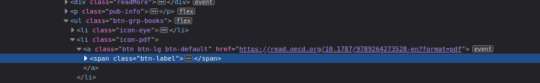
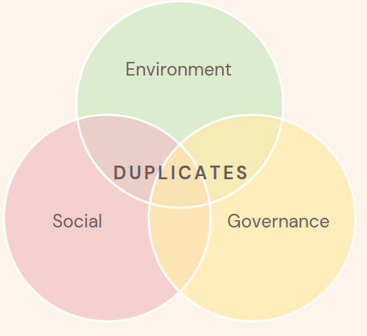

By Group "Raw Text Connoisseurs"

With the lack of common consensus on what the ESG concepts encompass among listed companies, the second technical problem we have faced is to decide on how to properly extract a set of representative keywords from each theme we were trying to quantify.

In coming up with a solution that can generate keyword lists that are both scalable and appendable, this problem has two aspects to it - how to collect data from different sources and how to combine numerous potentially different data formats into one condensed list of keywords.

# Aspect 1: Collection of Data from different sources
As Raw Text Connoisseurs, we decided to extract keywords from dedicated reports that explicitly covers the topic of interest in PDFs and HTML format. Using reports ranging from OECD insight reports, International Labour organisation reports and g20 report on labour, the project demanded a differentiated approach for the HTML and PDFs.


## Problem 1: Deciding on how to collect data
For data collection, our team first started with selenium web scraping. We believed that this would be an appropriate module to use due to its ability to handle dynamic web pages. However, as we delve deeper into the potential information sources, we found that they were more commonly listed on static web pages or download links that lead to a PDF file. The goal in this section is to transform both PDF and HTML information sources into a large String object in preparation for further analysis in NLTK. 

###**Solutions**:
#### HTML
For HTML, evaluating against the use case, we find the combination of beautiful soup and requests more efficient in the task. With both doing the same task, Beautiful Soup was able to more efficiently extract the entire text with fewer lines of code. As we will be scaling the project up along the process, this is a welcomed improvement to remove bulks from our program. See the following code snippet as an example:

```python
def extractHTML(file):
    text = ''
    soup = BeautifulSoup(file, 'html.parser')
    paragraph = soup.findAll('p')
    
    for p in paragraph:
        if not p.findChildren('a') and not p.has_attr('class'):
            text += p.get_text(strip = True)
    return text
```

#### PDF
For PDF, it is recognised that the official links did not provide readable HTML directly and instead leads to downloading the documents locally. For this, we employed the urlib request to first localise the PDF document to the file location of the script and then perform textract extraction. This method has effectively transform the text into a large chunk of string for further analysis
```python
def processPDF(url, fileName):
    opener = urllib.request.build_opener()
    opener.addheaders = [('User-Agent', 'MyApp/1.0')]
    urllib.request.install_opener(opener)
    urllib.request.urlretrieve(url,fileName)
    
    raw = textract.process(fileName)
    return raw.decode("utf8")
```
<br>
## Problem 2: Website specific problem and solutions
During the process of localising PDFs onto our folder, two website-specific problems were encountered and quickly resolved. 

### Problem 2.1: Headless Browsers
The first problem was that the website returned a HTTP error 403 when we tried to retrieve the data. 

**Solution**:
Upon investigation, it was discovered that some web pages by default reject browsers without any headers to protect their websites from potential attacks. For this, we learned that urllib included the functionality to add a header to our browser and that this seemingly minor adjustment could lead to a fail or success scenario.

```python
opener.addheaders = [('User-Agent', 'MyApp/1.0')]
```

### Problem 2.2: Temporary Download Links
Another problem with extracting PDF came from the website design for PDF downloads. In OECD report, when one click on the download link for the reports, the JavaScript on the website generates a temporary download link to the report. In the project settting, using such link will be troublesome as it would lead to inconsistent performance each time it is ran. 

https://www.oecd-ilibrary.org/docserver/9789264273528-en.pdf?expires=1648390628&id=id&accname=guest&checksum=CAC9D8C20A83BC67F5A43C99461F5236

As you can see in the link abo ve, they have a expires=1648390628 part in the link. Although this can be solved by implementing selenium, it does not sound reasonable for us to use another web scraper only for 1 click to download PDFs.


**Solution**:
Through more investigation around the HTML written for the OECD, it was realised that another download link is actually used as parameter to obtain a temporary download link for the OECD PDF document. Upon discovering this link form the website, we replaced the document extraction link with the link used in the parameter and the limited duration of download link was no longera  problem for our project. 


<br>

# Aspect 2: Extract keywords and Combine lists into one condensed list of keywords
Once the keywords were gathered as a large group of raw text, the project chose to employ the NLTK language kit to handle language processing. As demonstrated in the code snippet below, the text will go through multiple processes:

**Process:** <br>
1. tokenise words that are alphabets <br>
2. remove stopwords from the tokenised words <br>
3. lemmantise words <br>
4. only keep the most frequent 100 words <br>
5. extract keys to form lists <br>

## Problem 3: Avoiding duplicate within same list
As the keyword analysis is highly reliant on the quality of the keywords, having duplicated keywords in a list will heavily damage its reliability. This problem is bound to occur as documents of similar topic is bound to use some common words among each other. This problem require a solution that keeps only 1 copy of each word across the list.

 **Solution**:
Using our understanding towards datatype and their unique charactersitics in Python, this issue is actually resolvable with one line. As keys of dictionary do not tolerate duplicates, after extending into the new list of keywords into a consolidated list, by changing the list into a dictionary and back to a list, it will be strip of all duplicate keywords. The implementation of this is as follow:

```python
# example
arr = [1,2,3,5,5,2,3]
arr = list(dict.fromkeys(arr))
# Result = [1,2,3,5]

# how it is used in the project
governance_key.extend(keywordExtract(gov_raw,100))
governance_key = list(dict.fromkeys(governance_key))
```
<br>

## Problem 4: Avoiding same keywords across the three ESG keywords theme
Although it is fine for innovation keywords to overlap in some extent with the other ESG factors as it is used as a measure to track innovation effort of firms, it will be damaging for the project's performance if ESG keywords overlap across each other. The keywords that exist in all three Environment, Social and Governance keyword list should be removed.

 **Solution**:
Using the concept from venn diagram, if we check for intersection of the three keyword list, we can extract a list of duplicated keywords that would allow us to filer in the final step:



```python
arr1 = ['apple','bob','car','dog']
arr2 = ['bob','car']
arr3 = ['dog']

# find relation arr1 -> arr2, arr1 -> arr3 and arr2 -> arr3
duplicates = list(set(arr1).intersection(arr2))
duplicates2 = list(set(arr1).intersection(arr3)) 
duplicates3 = list(set(arr2).intersection(arr3))

# add all of the intersection together to obtain all common words across the three list
common_words =list(set(duplicates + duplicates2 + duplicates3)) 

# Result = ['car', 'dog', 'bob']


# how it is used in the project
duplicates = list(set(social_key).intersection(governance_key))
duplicates2 = list(set(social_key).intersection(environment_key)) 
duplicates3 = list(set(governance_key).intersection(environment_key))
common_key =list(set(duplicates + duplicates2 + duplicates3)) 
toBeRemoved = common_key + continents + neutral_words

governance_key = [item for item in governance_key if item not in toBeRemoved]
environment_key = [item for item in environment_key if item not in toBeRemoved]
social_key = [item for item in social_key if item not in toBeRemoved]
innovation_key = [item for item in innovation_key if item not in toBeRemoved]

```


