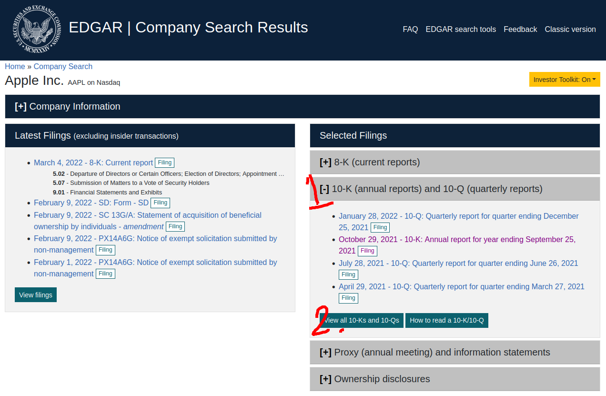
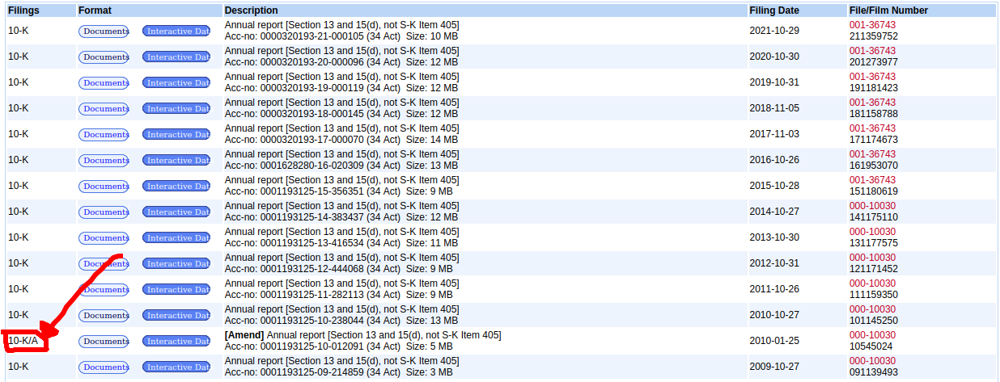

By Group "Raw Text Connoisseurs"

With the numerous limitation placed by SEC to limit web scraping activties and updates that made the 10-K website dynamic, Web scraping on the EDGAR platform had became a very complicated task. To make the web scraping process of specific 10-K reports from a specific time frame avaiable, a lot of issues were tackled on to reach our current solution. The following breakthrough was heavily inspired by [Theling - 10-K-scraper](https://github.com/Theling/10-K-scraper) with some modification to account for the changing structure on EDGAR website.  

# Problem 1: Dynamic Webpage
With the updated EDGAR search, a lot of clicking is required on the dynamically generated website. This is very difficult to implement for generalisation as different firms may have different amount of listing, making solutions with static parameters useless in this situaiton. 



### **Solutions:**
Instead of using the current search page, the classic version is used. Breaking down the filter and structure of the URL, it is found that the URL contains information of the filters and ticker a user use in their search. For this, a static link that pre-specify search on 10-K reports are used with ticker being the changed variable according to our list of company tickers.

Since we are using a static version of the site, we are back with our bread and butter - Request and Beautiful Soup duo.

```python
url = f'https://www.sec.gov/cgi-bin/browse-edgar?action=getcompany&CIK={ticker}&type=10-k&dateb=&owner=exclude&count=40'

allTenKs = requests.get(url, headers=headers)
```

# Problem 2: 10-K Report Amendments 
When company list their reports, there are times when their filings need to be amended. These cannot be filtered out by our previous implementation and had creeped into our program as an undetected bug.



### **Solutions:**
Upon discovering the bug, the solution of this issue is to also read the data category of the report from the table element on the page. When the program spot entries that do not exactly match the '10-K' string, it will skip the entry by adding 1 to the index used for extracting download link.

``` python
count = 0

for item in search_result:
	if itemDate in targetYears and documentType == '10-K':
		targetURL = 'https://www.sec.gov' + search_result[count].find('a', attrs={"id": "documentsbutton"})['href']

	if documentType != '10-K':
		count +=1
	
	count += 1
```

# Problem 3: Newly Introduced XBRL Viewer
Using Apple Stock as an example, starting from 2019, EDGAR filing had switched to using XBRL format to display their 10-K reports. This is very problematic as the usual method of extracting through wirting HTML content does not work with XBRL.

### **Solutions:**
Suprisingly, the solution also hid in the URL of the EDGAR platform. It is discovered that EDGAR added 'ix?doc=/' to the url for the HTML file to be open in the XBRL viewer. When we searched and remove this element from the URL, we arrive at a plain HTML as it was before 2019.

``` python
if 'ix?doc=/' in doc_url:
	doc_url = doc_url.replace('ix?doc=/','')
```

